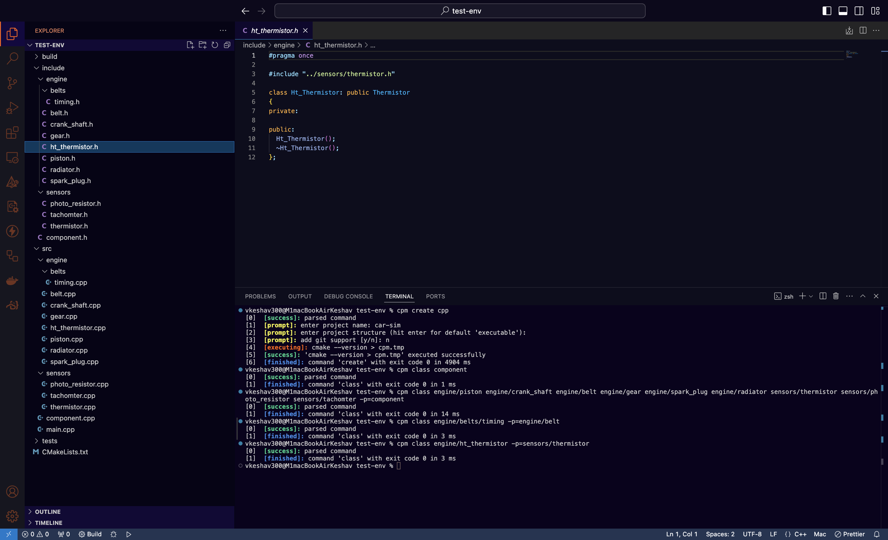

# C/C++ Project Manager (CPM)
[](https://github.com/vkeshav300/cpm/actions/workflows/codeql.yml)
[](https://github.com/vkeshav300/cpm/actions/workflows/pages/pages-build-deployment)

CPM is a simple, yet useful tool for managing your C and C++ projects.



Currently supports the following operating systems:
- All unix-based operating systems

### Building
#### Unix-Based Operating Systems
For building project (you may need to use sudo if you are getting `access denied` or `permission not granted` errors):
```
mkdir build
cd build
cmake ..
make
```
For building project and installing:
```
mkdir build
cd build
cmake ..
sudo make install
```

### Other information
The code uses 256-Color Mode [ANSI Escape Codes](https://gist.github.com/fnky/458719343aabd01cfb17a3a4f7296797) to color text. Not all terminals support coloring text. To check if your terminal does, run: 
```
echo -e "\x1b[38;5;196mTest\x1b[0m"
```
This should print the text "Test" in a red-ish color. Most modern terminals support coloring using ANSI Escape Codes.